# Azure Functions: An Introduction for DevOps Engineers

### Introduction

Azure Functions is a serverless compute service provided by Microsoft, enabling you to run small pieces of code on-demand without a need to build the underlying infrastructure to run that code. You can write code in a variety of languages and publish these blocks of code as functions, which is then hosted in Azure in a container called a Function App. Functions run when they are "triggered" and you'll see that in action in this guide. Though functions can run for a longer time under the premium and app service plans, the ultimate goal of a function should be to do a particular task and do that task as efficiently as possible.

In this first part of a multi-part guide, you will review Azure Function App plans and deploy an Azure Function App. Next you will examine the high-level components of the Function App, deploy a PowerShell based function and review the logic of a templated PowerShell webhook function. Afterwards, you will trigger the function using several different methods and observe the output and log stream. When you're finished you will have a PowerShell based Azure Function that you can modify to accept different types of input and perform actions when the function is triggered and have a fundamental understanding of what capability Azure Functions can provide.

## Prerequisites

Before you begin this guide you'll need the following:

- An [Azure Subscription](https://azure.microsoft.com/en-us/), you can create a free account if you don't have an existing subscription

## Understanding Function App Plans

Like any cloud service, it is important to understand what the cost is going to be and what options are available for optimizing that cost. Three plan types can be selected when you create a function app and each option influences the scalability, resource availability and support for advanced features. The plan type cannot subsequently be changed, so ensure you understand the options below upfront:
1. **Consumption.** This is the default hosting plan when creating a function app. Billing is based on the number of function executions, execution time and memory used. You only pay for the time your functions are running and scale is handled automatically by Microsoft. At the time of writing, there is a free grant (per month) from Microsoft for the consumption plan, allowing up to 1 million executions and 400,000GB-s (seconds) of resource consumption. By default, functions running under a consumption plan timeout in 5 minutes but can be expanded to a maximum of 10 minutes.
2. **Premium.** You can specify several warm instances that are always running and ready to run your function. At least one warm instance is required at all times per plan, meaning there will be a minimum monthly cost even if you don't trigger any functions. With that said, it does mean there is no cold start like you will see when triggering functions on a consumption plan. Functions running under a premium plan have a default timeout of 30 minutes and can be set to run for an unlimited time. Premium plans also provide some advanced capability when compared to consumption, such as being able to connect the Function App to an Azure Virtual Network (VNet) for more controlled connectivity.
3. **App Service Plan.** An App Service Plan is a set of dedicated compute resources in Azure where other App Service apps, such as a Web App, can run. Microsoft provided the ability to connect Azure Functions to an App Service Plan, meaning you can use the underlying resources in the App Service Plan for multiple services. Typically you would use this plan if you already have an App Service that isn't fully utilized or if you want to provide a custom image that your functions will use when they run.

The biggest downside that is usually associated with the consumption plan is that the functions are cold, meaning there will be a small lag time between when the function is called and when the execution of the function is completed. You will observe this later in this guide. Think about what your function is doing and whether the response from the function needs to be as quick as possible. If another process or a user is waiting on the result of the function running, it might be worthwhile to look at using one of the other plans.

## Step 1 — Creating a Function App

In this step you will create an Azure Function App using the Azure Portal selecting PowerShell as the runtime. This will provide the resources you need as the backbone to then create your first function.

First, it is important to understand the resources that are required when provisioning a function:

1. **Function App.** Think of this as the logical container that lets you group functions together. This will need a unique name in the Azure Cloud
2. **Storage Account.** Internally, functions use storage for operations of the function app

Optionally, you can enable Application Insights on the Function App to provide monitoring of the function app and functions.

Let's get stuck in and create your first function app. Log in to the [Azure Portal](https://portal.azure.com/) and search for **Function App** and then click **Create Function App**.

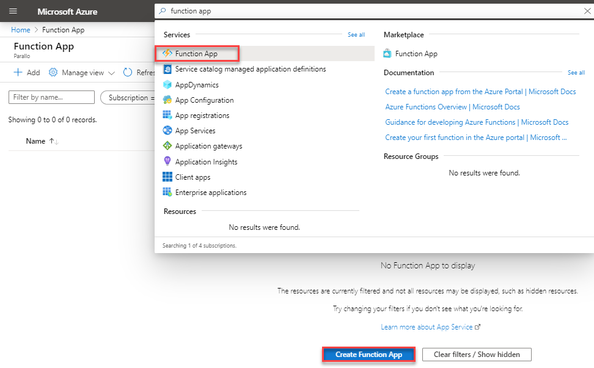

Fill out the basic information for the function app and then click on **Next: Hosting**:
- **Subscription**: Select the Azure subscription that you will deploy this function to.
- **Resource Group**: We're creating a new resource group for this demo called functiondemo
- **Function app Name**: This is the name of your function app and will be the URL used to access functions within your function app. As noted above, this needs to be globally unique.
- **Publish**: There is capability to publish a function as a docker container rather than raw code, but for this demo select Code.
- **Runtime Stack**: Use this to select the language that your functions will be written in. For this demo, use PowerShell.
- **Version**: Depending on the language you select, there may be different versions available to use in the runtime. At the time of writing, version 6 is the only one available for PowerShell
- **Region**: Select the Azure region where your function app will be hosted

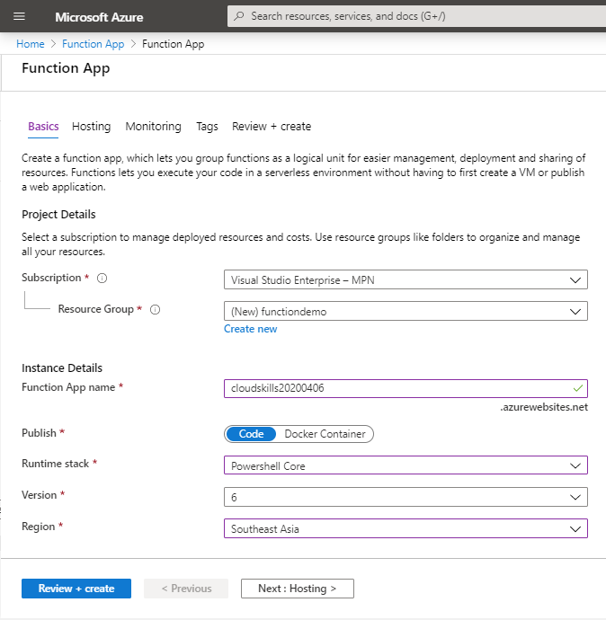

On the next page we get some options for the hosting of the app function. Select your desired options and then click **Next: Monitoring**

- **Storage Account**: A storage account is required for a function app. Either choose an existing account or create a new one. We're creating a new account for this demo.
- **Operating System**: Depending on your chosen runtime you can select the underlying Operating System that your functions will run on. We're using Windows as it is the only option for PowerShell
- **Plan Type**: As we covered in the introduction, this is where you select the plan for the function app. This can't be changed later. For this demo we're using the consumption plan.


You can optionally enable Application Insights and add tags to the resources being provisioned. We aren't looking at App Insights in this demo, so we've chosen not to enable it. Disable Application insights then click on **Review + Create**. Go ahead and review your selections and click **Create** to provision the resources.

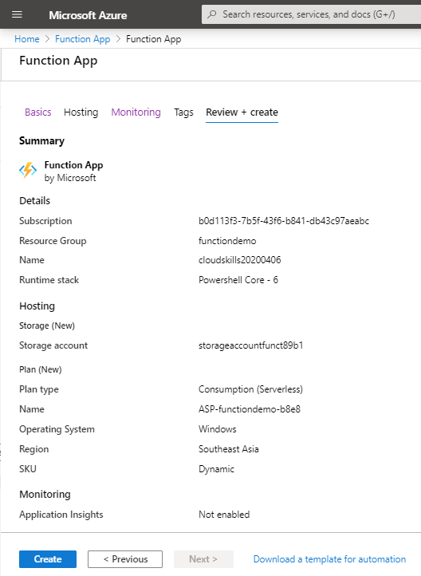

Finally, let's look at what was provisioned. If you followed along you will have:

1. An App Service Plan
2. An Azure Storage account
3. An App Service

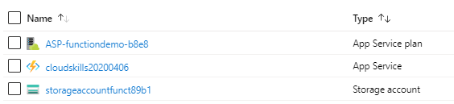

In the next step you will look at the App Service and create a function.

## Step 2 — Creating Your First Azure Function

In this step you will create a PowerShell Azure Function using the Azure Portal.

Using the Azure Portal, search for Function App and  click on the Function App you provisioned in the previous step. The Function App is currently empty, so click on either the **+** next to Functions on the left-hand side or click on the **+ New Function** button to create a new function.

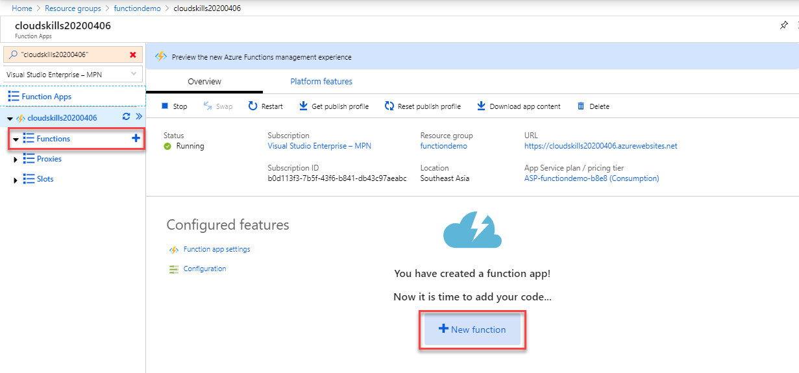

Some different tools and methods can be used to create and configure Azure Functions. One of the options is to create the function in the Azure Portal, which is suitable for getting started. In a later blog in this series we will look at using Visual Studio Code for local development and publishing, but for now select **In-Portal** and click **Continue**.

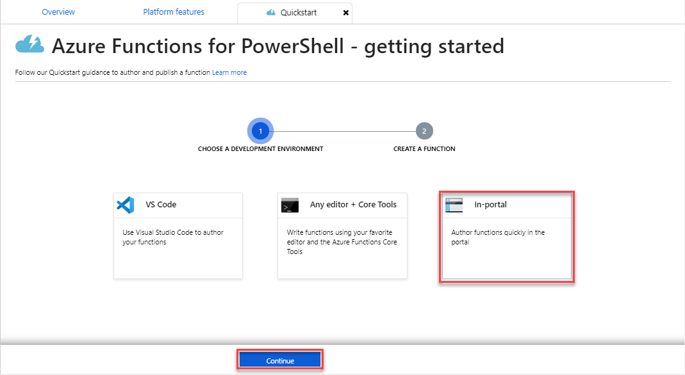

Microsoft provides several templates for functions to help you get started quickly depending on what you want your function to do. For this demo select **Webhook + API** and click **Create**.

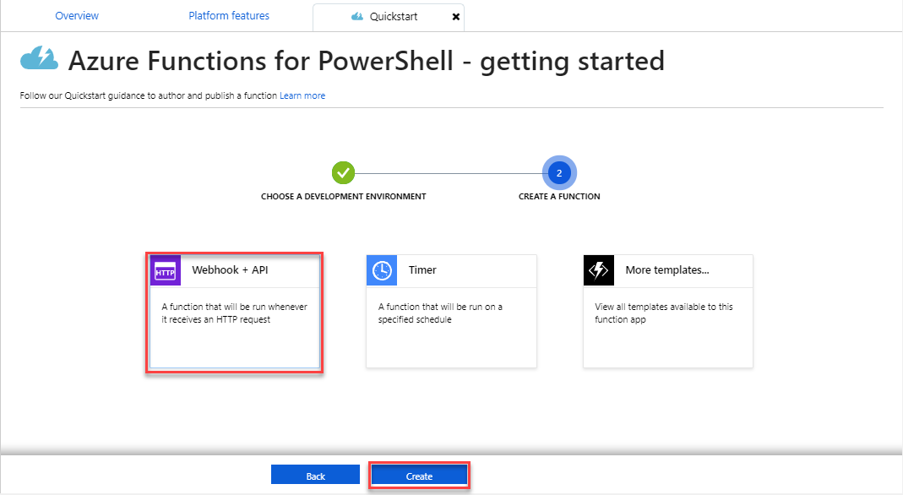

A new function is created within the function app and you are presented with PowerShell code as a template for the function.

In the next step, we will review some important files that have been created as part of the function and break down the example PowerShell function to understand the workflow.

## Step 3 — Reviewing the Function in the Azure Portal

At the bottom of the screen, click on the arrow next to Logs. The Logs window provides a streaming view of the logs which can be useful when wanting to debug or troubleshoot a function. you will see this in action when we run the function in the next step.

On the right-hand side of the screen, click on the arrow to expand a pane where you can view the files in the function.

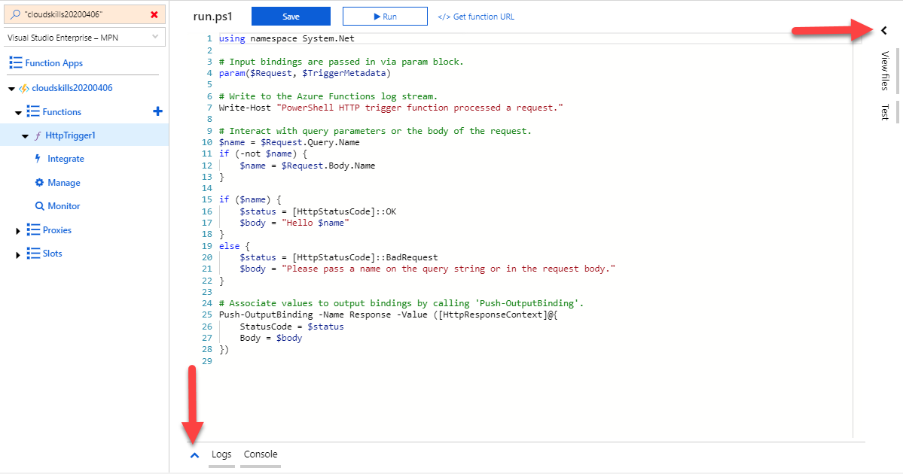

Each function contains two important files that you need to be familiar with that you can see in the panel on the right hand side. You can click on each file to view it in the editor:

- **Run.ps1**. This is the PowerShell function that is currently open in the portal editor. This is the code that gets run when your function is triggered.
- **function.json**. This is a configuration file that defines the behavior of the function, such as how it gets triggered, what authorization is required and so forth.

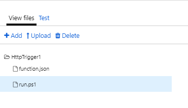

Speaking of authorization, three values can be used:

1. **anonymous**: No API Key is required and the function can be triggered by anyone
2. **function**: A function-specific API Key is required in the call to the function
3. **admin**: The master key is required in the call to the function

By default, functions use the **function** authorisation option.

Click on **Run.ps1** if you don't already have it selected and let's break down the logic in the example function.

The first line is to ensure the `System.Net` library is being used in this function. Like a standard PowerShell function, some parameters have been defined:

- **Request**: This will contain the data coming in from the external HTTP trigger, via a query or a body and this information will be available in this variable in the rest of the script
- **TriggerMetadata**: This parameter is optional and can be used to access extra information about the trigger. The metadata available does vary from binding to binding, but they all contain a `sys` property with some data

```PowerShell
using namespace System.Net

# Input bindings are passed in via param block.
param($Request, $TriggerMetadata)
```

The following is an example of using Write-Host to output information to the Log stream. You will see this in the Log console when we run the function a little later on.

```PowerShell
# Write to the Azure Functions log stream.
Write-Host "PowerShell HTTP trigger function processed a request."
```

In the following lines, we are looking to see if a Name value has been provided by the person or process that triggered the function, either as a query parameter or in a body send with the request.

If a value was provided for `Name`, it is stored in the variable `$Name` and the `$status` variable is set to `[HttpStatusCode]::OK`. The function would then keep running to the next block below. If a value for `Name` cannot be found on the incoming request, the `$status` variable is set to `[HttpStatusCode]::BadRequest` and a custom message is put in to the `$body` variable.

One way or another, when this piece of code completes, we will have values for `$status` and `$body`.

```PowerShell
# Interact with query parameters or the body of the request.
$name = $Request.Query.Name
if (-not $name) {
    $name = $Request.Body.Name
}
if ($name) {
    $status = [HttpStatusCode]::OK
    $body = "Hello $name"
}
else {
    $status = [HttpStatusCode]::BadRequest
    $body = "Please pass a name on the query string or in the request body."
}
```

The final part of the function is to call `Push-OutputBinding` and provide the values back to the caller of the function, now that their data has been processed:

```PowerShell
# Associate values to output bindings by calling 'Push-OutputBinding'.
Push-OutputBinding -Name Response -Value ([HttpResponseContext]@{
    StatusCode = $status
    Body = $body
})
```
You can edit the `function.json` and `run.ps1` files directly in the Azure Portal and click on Save at the top to save the file.

In the next step, you will get your hands dirty and trigger the function in a few different ways and observe the output.

## Step 4 - Running the Function

Now that you understand the logic of the function when it is triggered, in this step you will trigger the function in a few different ways to observe the behavior. We can use the Azure Portal to trigger the function and observe the logs and the output.

In the Azure Portal, ensure you are still on the screen with the `run.ps1` function and you have the logs visible from the panel at the bottom, and the Test area showing in the pane on the right. Your screen should look like this:

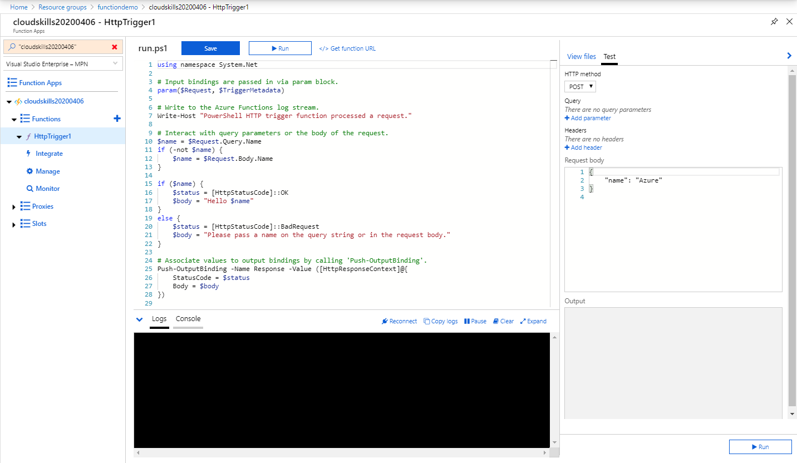

In the test area, ensure the HTTP method is set to GET and then under query, ensure there is nothing in the name or value fields (if they are showing) and then click **Run** down the bottom. Notice that the function takes a few seconds to complete. This is because of the cold start on the consumption plan. Because we didn't pass the function a name with a value, either in the query or in a request body, the function will fail and we will receive the response code 400 with a message telling us to pass a name.

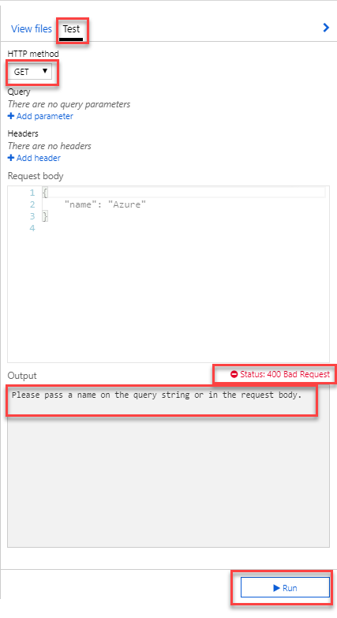


Behind the scenes, this is the actual URL that was used to trigger function:

```
https://cloudskills20200406.azurewebsites.net/api/HttpTrigger1?code=jWiMZha0KyfCSUOEDUXb7F9TbOgMBCHIQP52nJqnoZdsZaKB2CBhMQ==
```

If we break that URL down further, this section is the FQDN of the function app and the name of the function we are triggering:
```
https://cloudskills20200406.azurewebsites.net/api/HttpTrigger1
```
And below, after `?code=` is the function key that we need to append to the trigger, because the function is expecting this for authorization:
```
?code=jWiMZha0KyfCSUOEDUXb7F9TbOgMBCHIQP52nJqnoZdsZaKB2CBhMQ==
```

If the authorization in the function.json file was set to anonymous, we would not need to append this key. There are a few ways to get the key to use, the easiest way on the screen you are on is to click on the `</> Get Function URL` at the top of the screen:

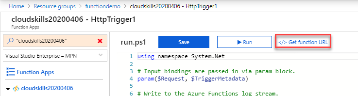

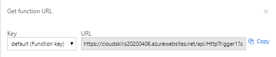


Go  over to the right-hand pane and this time click on **Add parameter** under `Query`. Enter **name** for the name, put your name in the value and click on Run again. This time you will see a Status 200 returned, and the output will display "Hello \<yourname>\".

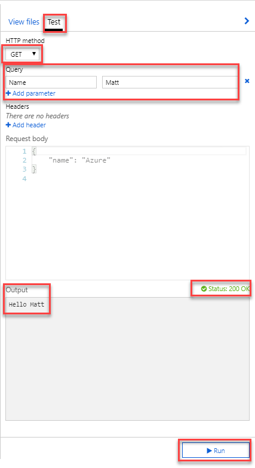

Behind the scenes, this is the URL that was used to run the function this time. You can see the query for name and the value appended to the end.

```
https://cloudskills20200406.azurewebsites.net/api/HttpTrigger1?code=jWiMZha0KyfCSUOEDUXb7F9TbOgMBCHIQP52nJqnoZdsZaKB2CBhMQ==&name=Matt
```

Next, instead of sending the name as a query, send it as a key value pair in a JSON body. Change the HTTP method from GET to POST and to clean up, click **x** to remove the query we used in the last step. In the Request Body, by default it will have a JSON payload with a key value pair of `name` and `Azure`. Leave that for this demo, and click on **Run**. Again, you will see a status 200 returned and the output will change to "Hello Azure".

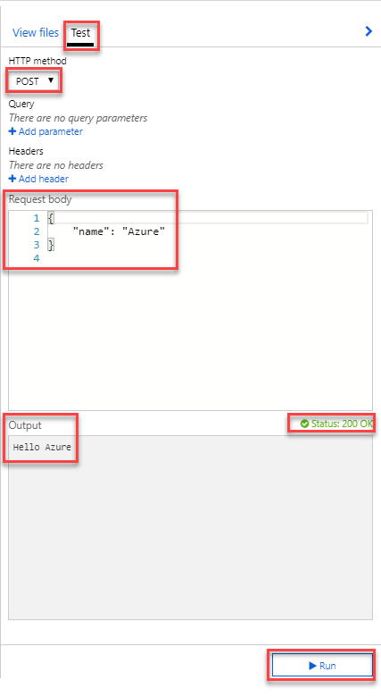

Hopefully you've been looking at the Logs window every time the function has been triggered, though sometimes it can be a bit buggy. If not, we will examine it now. The first and third lines are informing us that the trigger has been called and has been executed. The second line is the output from line 7 in the Run.ps1 file, showing how we can use `Write-Host` within a function to output information to the log stream.

```
2020-04-06T09:56:12.450 [Information] Executing 'Functions.HttpTrigger1' (Reason='This function was programmatically called via the host APIs.', Id=29592acd-dd21-4cc0-b5de-ca9481a9148b)
2020-04-06T09:56:12.494 [Information] INFORMATION: PowerShell HTTP trigger function processed a request.
2020-04-06T09:56:12.494 [Information] Executed 'Functions.HttpTrigger1' (Succeeded, Id=29592acd-dd21-4cc0-b5de-ca9481a9148b)
```

## Conclusion

In this article you have explored the capabilities of Azure Functions and reviewed the options available for running the functions in different App Plans.

You deployed a new Function App in Azure and created a new function based on a webhook trigger. Once the function app was available, you reviewed the authorization options and reviewed the logic provided in the default templated PowerShell function.

Finally, you triggered the function using several methods that provided varying results and observed the output both in the Azure Portal and in the Log Stream.

In the next post in this series, you will review PowerShell based functions in detail, creating examples where the function will perform actions on Azure resources based on particular logic and output the results to a binding other than HTTP.