# Azure Functions: Creating a PowerShell Event Based Function

### Introduction

In the first post in this series, you created a basic Azure Function based on a HTTP webhook trigger and learned some of the fundamental concepts of Function Apps and functions. While webhook functions certainly are valuable and solve problems, some powerful workflows can be created that are based on event-driven data.

In this guide you will create a new function that will integrate with Azure Event Grid, resulting in the function being triggered when a particular event takes place. You will analyze the data being sent to the function by event grid to understand what you are working with.

You'll also set up an Azure Storage account to use as an output binding from the function. When the function is triggered, you will use logic to get data from the triggered event and insert that into a new row within Azure table storage in the destination storage account.

The goal in this guide is to trigger a function when a file is uploaded to blob storage in a specific storage account. If the file is a CSV file, the function will collect some data from the incoming event data, specifically, the file name of the CSV that was uploaded and using an output binding, will insert a new row into an Azure Storage Table with some data from the event.

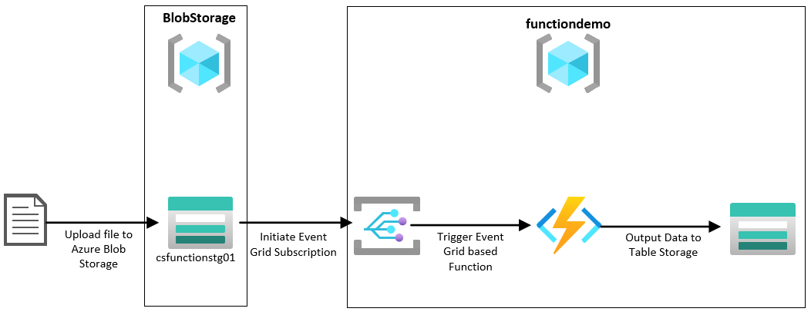

When you're finished, you'll have a good understanding of how event-driven data can be used with Azure Functions and have exposure to creating output bindings to send processed data in the logic of the function to external components.


## Prerequisites

Before you begin this guide you'll need the following:

- (optional) Familiarity with PowerShell would be beneficial
- An [Azure Subscription](https://azure.microsoft.com/en-us/), you can create a free account if you don't have an existing subscription
- An Azure function app based on PowerShell to create a new function in. If you have the function app from post one in this series, you can use that.
- A Storage account where blobs will be uploaded to be the event grid trigger. In this demo I created a separate resource group and storage account for this by running the following PowerShell commands from [Azure Cloud Shell](https://shell.azure.com):
```powershell
New-AzResourceGroup -Name BlobStorage -Location "Southeast Asia"
New-AzStorageAccount -Name csfunctionstg01 -ResourceGroupName BlobStorage -Location "Southeast Asia" -SkuName Standard_LRS
```

## Step 1 — Creating an Event Grid Based Function

This guide uses the function app created in the previous post in this series. If you don't have a function app, refer back to that post to create one for use here.

First, log in to the [Azure Portal](https://portal.azure.com/) and search for **Function App**. Our function app is called `cloudskills20200406`, so click on that. Yours will be called something different.

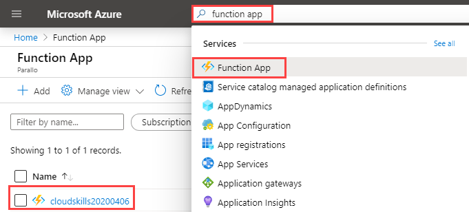

In the panel on the left-hand side, click the **+** next to **Functions** to create a new function.

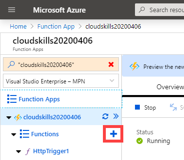

Scroll down and select the **Azure Event Grid trigger** and give the function a name. Ours will be called `CSEventGridTrigger`. Click **Create** to create the new function.

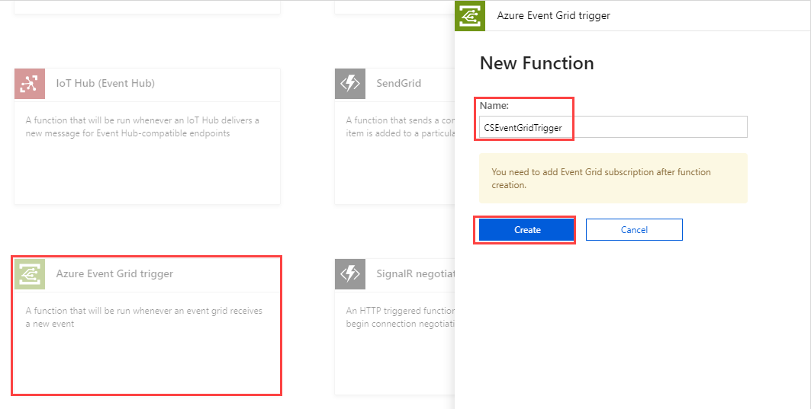

You will be taken to the PowerShell code editor for the new trigger. You will notice there is a parameter named `eventGridEvent`. This is the variable that will contain the incoming event data, which we'll need to explore after configuring an Event Grid subscription.

At the top of the window, click on **Add Event Grid subscription**.

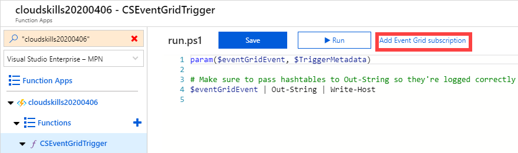

On this page you are presented with some forms to fill out to create the event subscription. This will be looking at the storage account we created in the prerequisites section of this guide. A few things to note:

- You can optionally create filters and additional features of the event subscription to further target which events you are interested in, to trigger the function. For example, you could create a filter here so that only events where a CSV file was uploaded to blob storage are delivered to the function. You'll be doing this logic in the PowerShell function itself, this is just an example
- For the topic type, observe the different resources that can be selected within an event subscription
- On the event type, in our example this is filtered to just show `Blob created` as this is the only event we are interested in having trigger the function

Fill out the basic information for the event subscription and then click on **Create**.

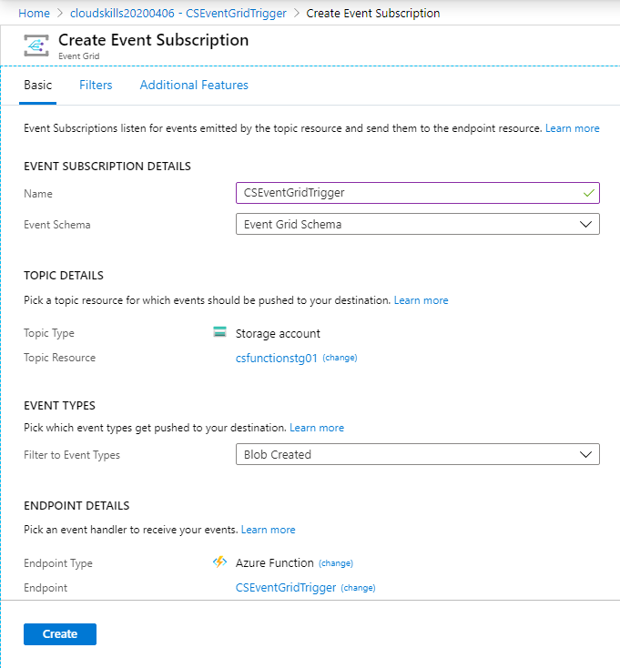


You've created a new PowerShell function and configured an Event Grid subscription to send data to this new function based on particular event types.

## Step 2 — Reviewing Event Grid Data Sent to the Function

Now that you have an event grid subscription created, you need to understand what data and properties are being sent to the function by event grid. Without this information, it will be difficult to maniuplate the data and write logic into your function.

In the template that was created for us, the `$eventGridEvent` variable is being output to the host, so if we trigger the function we can see the data in the Logs console. An alternative method is to convert the object to JSON and then output that, giving us the full data structure to copy into a text editor to view the data structure and properties.

Replace line four with the following code and click **save**. Your function should look the same as the image below.

```powershell
$eventGridEvent | ConvertTo-Json | Write-Output
```

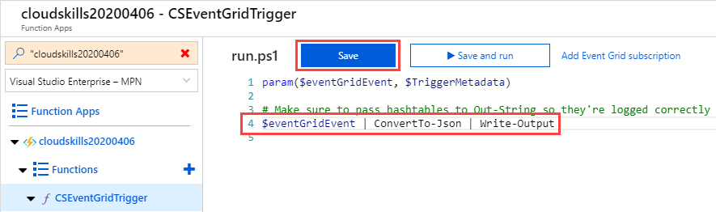


Click on **Logs** at the bottom to reveal the log-streaming service. Click on Expand to make the window larger. You will come back to this window in a moment to review the output.

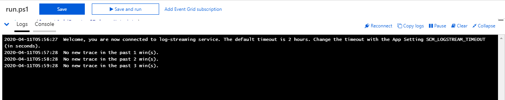

Next, you will perform an event that causes the function to trigger and review the event data. Open another browser tab or window with the Azure Portal open and navigate to the storage account that was created in the prerequisites section of this guide. After clicking on the storage account, use the search feature in the properties pane and search for **Containers**.

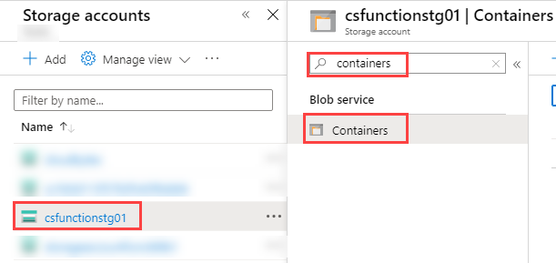

Click **+ Container** to add a new container. In this guide, the container is called `test` and has the default private access.
 
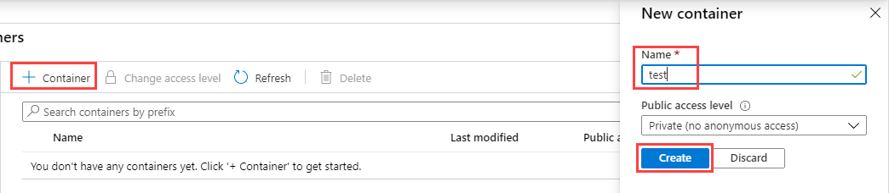

Click on the newly created container and then click upload to upload a small test file from your computer, such as a text file. Click **Upload** to upload the file.

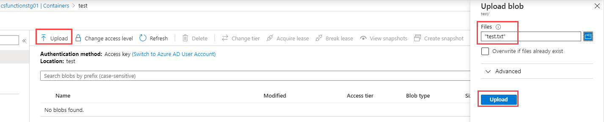

Switch back to the window or tab where we left the log streaming running within the function. After a few moments you will see the function has executed. In the log-stream output you will see a JSON body showing the properties and data sent to the function by the Event Grid service, as shown in the image below (the highlighted text is the JSON data). You can copy this data to a text editor to observe as you build out the logic of your function. For example, there is a property in this JSON output named `subject`. To reference or use that in the function itself, you can use now use `$eventGridEvent.subject`.

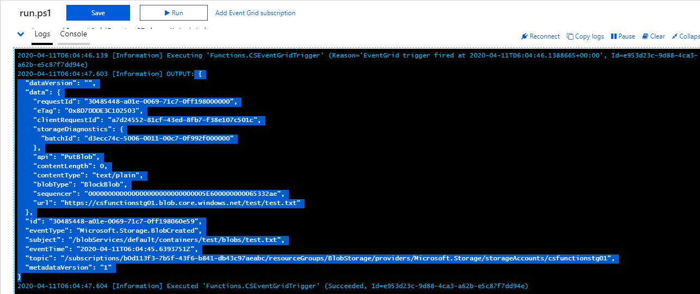

When you are finished, close the log streaming console (or collapse it) so we can see the `run.ps1` script again. Leave your other tab or window open with the storage account where you uploaded the blob, that will be used again later in this guide.

## Step 3 — Configuring an Azure Table Storage Output

When you come up with an idea for a function to solve a problem or add value, the function itself often won't be the end of the line. You will find requirements for your function needing to send data to another application or system, whether that be for logging purposes, triggering another downstream process, creating an alert, and so on. Azure functions have a concept called output bindings, which are preconfigured connectors provided to you so you don't need to code the connection in manually from your function. In this step, you will create and leverage an output binding to write data from the function in to a row in Azure Table Storage.

First, you need to create the output binding for the function. In this example, you are going to output the result to a new Table named `FunctionOutput` hosted in the same storage account that is already being used by the function app. You probably wouldn't *normally* do this, it is just to save creating another storage account as we already have one we can use.

In the left-hand side panel under your function, click on **integrate**. Under Outputs, click on **+ New Output**, select **Azure Table Storage** and click **Select**.

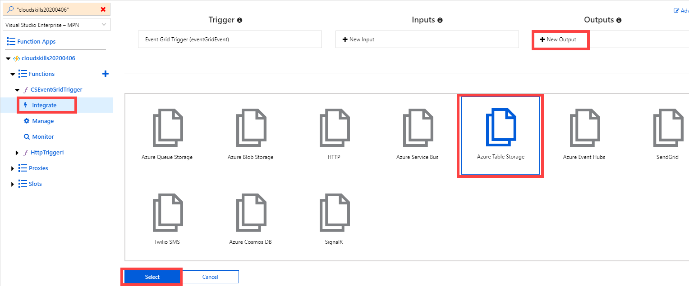

Change the **Table Name** to `FunctionOutput`. Notice the parameter name is set to `outputTable`, this is what will be used later in the PowerShell function output binding. Leave the default Storage account connection as this will automatically select the storage account associated with the function app, but if you did want to select a different storage account as the target, you can click **new** and select an alternative storage account (or create a new one). Click on **save** to save the output binding.

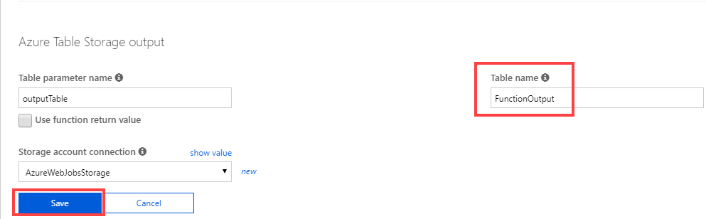

In the left-hand side panel, click on your function name to be returned to the `run.ps1` script where we will bring everything together with some PowerShell logic to pull some properties from an incoming event grid trigger and output them to Azure Table Storage.

## Step 4 - Putting Logic in the PowerShell Function

Let's do a quick recap of where we are at. So far we have:

1. Created a new PowerShell function based on an Event Grid trigger
2. Created an Event Grid subscription which is looking for a `Blob Created` event and will send the event data to the newly created function
3. Triggered the event by uploading a test file to the blob storage and viewed the contents of the event data that is sent to the function
4. Created a binding output based on Azure Table Storage to a separate storage account

Finally, you will put some logic into the `run.ps1` file to process the event grid data and then use `Push-OutputBinding` to send the processed data to Azure Table Storage.

Below is a small example of what you will run in the PowerShell function. Copy and paste this into the `run.ps1` file in the Azure Portal and click **Save**.

```powershell
param($eventGridEvent, $TriggerMetadata)

Write-Host "New event occurred - $($eventGridEvent.eventType)"

$SubjectName = $eventGridEvent.subject -split "/"
$FileName = $SubjectName[-1]

if ($Filename -like "*.csv") {

    $Data = [PSCustomObject] @{
    partitionkey = $eventGridEvent.eventTime
    rowkey = $eventGridEvent.id
    FileName = $Filename
    Action = $eventGridEvent.data.api
    }

    # Associate values to output bindings by calling 'Push-OutputBinding'.
    Push-OutputBinding -Name outputTable -Value $Data
}
```

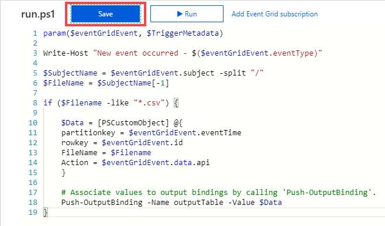

Let's break down some components of the PowerShell code being used in this example.

Firstly, you define some parameters to be used within the function. `$eventGridEvent` is the name of the parameter that will store data from the inbound Event Grid subscription. Then `Write-Host` is being used just to show an example of writing some information to the log stream.

```powershell
param($eventGridEvent, $TriggerMetadata)

Write-Host "New event occurred - $($eventGridEvent.eventType)"
```

Next, it is going to get the data stored in `$eventGridEvent.subject` and split it based on the forward slash. You can tell that this needs to be done by examining the output data from step 2. After the data has been split, we are looking for the file name which will always be the last item, which can be accessed by using `[-1]`. The filename is stored in a variable named `$FileName`.
```powershell
$SubjectName = $eventGridEvent.subject -split "/"
$FileName = $SubjectName[-1]
```

Finally, if the file name ended in `.csv`, a custom PowerShell object will be created. Data is being pulled from the Event Grid data by accessing properties of `$eventGridEvent` as well as defining the file name that we extracted in the previous step. The `partitionkey` and `rowkey` values are specific to Azure Table Storage and these provide unique IDs to that row of data. Conceptually you do not need to worry about these, but if you are following along and weren't familiar, you may have wondered why those properties were included.

The last step is to use `Push-OutputBinding` to send the data in the custom object to Azure Table Storage, specifically the endpoint we defined in Step 3.
```powershell
if ($Filename -like "*.csv") {

    $Data = [PSCustomObject] @{
    partitionkey = $eventGridEvent.eventTime
    rowkey = $eventGridEvent.id
    FileName = $Filename
    Action = $eventGridEvent.data.api
    }

    # Associate values to output bindings by calling 'Push-OutputBinding'.
    Push-OutputBinding -Name outputTable -Value $Data
}
```

## Step 5 - Triggering the Function and Reviewing Output

Using Azure Portal, go to the storage account you created in the prerequisites section of this guide. You should still have this open in another browser window/tab from Step 2. It will have a container and a test file already from step 2. Upload another document by clicking **Upload**, select a CSV file from your computer and then click **Upload** again.

Optionally, navigate back to the log stream console of the function to monitor the function being triggered.

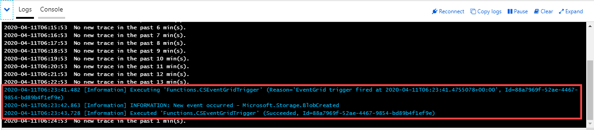

If you have Azure Storage Explorer installed, you can use that to connect to the storage account that is being used by the function app and look at the table storage. There should be a new table named `functionOutput` with a row of data that was inserted by the output binding.

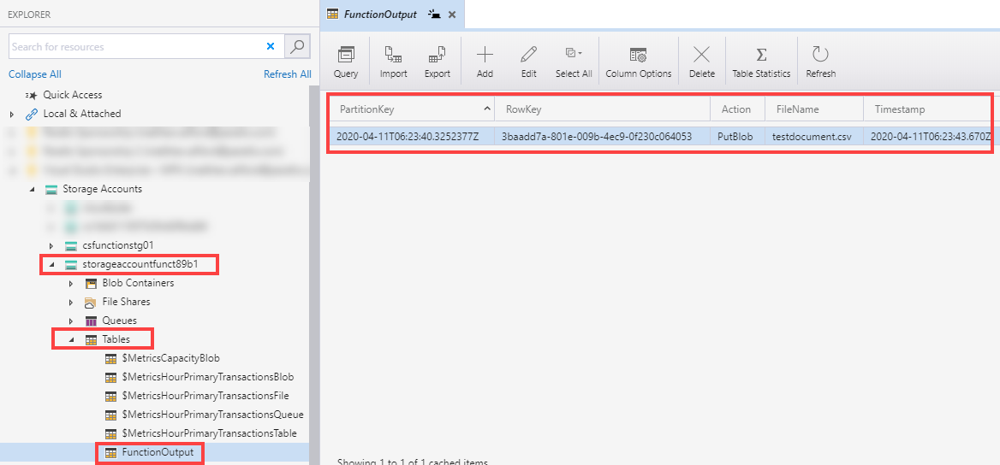

Not everyone may have Azure Storage Explorer installed and configured and it is OK if you don't, though it is a great utility to have. In this next step you will use PowerShell in the Azure Cloud Shell to review the output data.

Open a new Cloud Shell, either by clicking on the cloud shell icon in Azure Portal, or in a new browser window or tab navigate to https://shell.azure.com. If you still have the tab open from a previous step, you can use that but you may need to reconnect your session. You can use the code below to look at the data in table storage of the same Azure Storage Account that is being used by your function app. Just be sure to change the name of the resource group hosting your function app specified in `$ResourceGroup` below.

The code below assumes you used the default storage account within the function app for the output binding and that there are no other tables in that storage account.

```powershell
# Install the aztable Ps Module
Install-Module aztable

# Get the storage key for the storage account
$ResourceGroup = "functiondemo"
$storageaccount = Get-AzStorageAccount -ResourceGroupName $ResourceGroup

$storageAccountKey = (Get-AzStorageAccountKey -ResourceGroupName $ResourceGroup -Name $storageaccount.StorageAccountName).Value[0]

# Get a storage context
$stgcontext = New-AzStorageContext -StorageAccountName $storageaccount.StorageAccountName -StorageAccountKey $storageAccountKey


$table = (Get-AzStorageTable -Context $stgcontext).CloudTable

Get-AzTableRow -Table $table | ft
```

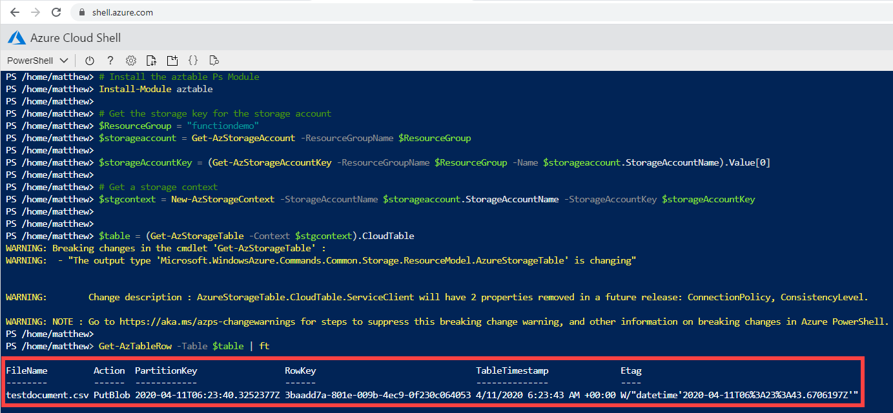

You can see the data that we collected in our custom object inside the function has been inserted in to the Azure Storage table as a new row.

## Conclusion

In this article you created a new PowerShell function based on the Azure Event Grid template. You then configured an Event Grid Subscription to listen for an event type of `Blob created` on a particular storage account, which would send the event data to the PowerShell function. Next, you tested the trigger and observed the contents of the event by outputting it to a JSON object, viewable in the function log stream.

Afterward, you configured an output binding for Azure Table Storage using the default storage account that is created with the function app. You then updated the code within the `run.ps1` file which inserted a subset of selected data to Azure Table storage if a CSV file is uploaded to the source blob storage account. You then uploaded a CSV file to trigger the logic from end-to-end and finally reviewed the output in Azure Table Storage.

While the specific example used in this guide may not provide any immediate real-world value, the purpose was for you to observe and understand the power of event-based functions and explore methods to have the function pass this data on to another system or process via an output binding. The options are effectively limitless and now you can put your imagination to the test to build functions, adding value to you and/or your customers.

In the next post in this series, you will create another event-based function and explore the ability to have the function authenticate and modify Azure resources and access secrets from Azure Key Vault.