# Managing Authentication and Secrets

### Introduction

Azure Functions provide flexibility with your workflows and logic processes, no doubt about it. In parts one and two of this blog series, you created different types of Azure Functions, provided input data with a trigger, configured event-based triggers and used output bindings to send data to other applications.

To date in this series, you have not worked directly with Azure Resources using the `Az` PowerShell module within the function itself. This is because access to Azure resources from the functions have not yet been configured. Additionally, you have not been shown how to handle passwords or secrets you may need to leverage within the function, you definitely don't want to be storing those in plain text in the `run.ps1` file itself.

In this guide, you will configure a managed identity on the function app and provide access to Azure resources for that identity using Azure role-based access control. Next, you will deploy an event grid function that shows this access working by setting tags on Azure resources based on logic within the function. Finally, you will learn how to securely access secrets stored in Azure Key Vault from within a function.

When you're finished, you'll be able to securely provide Azure functions with role-based access to Azure resources and leverage password and secrets in your functions that are stored in Azure Key Vault.

## Prerequisites

Before you begin this guide you'll need the following:

- (optional) Familiarity with PowerShell would be beneficial
- An [Azure Subscription](https://azure.microsoft.com/en-us/), you can create a free account if you don't have an existing subscription
- An Azure function app to integrate with Azure and create a new function in. If you have the function app from post one in this series, you can use that. This post follows on from post two in this series and will be using the same function app `cloudskills20200406`

## Step 1 — Configuring a Managed Identity and Role Based Access Control

There will be times in your functions that you want to read, modify and maybe even delete resources within your Azure subscriptions. By default, the functions you create do not have permission to manage any of your Azure resources, whether that be in the same or separate subscriptions. By configuring a managed identity and setting role-based access control, the function app (and therefore all functions within the function app) will have the permission to manipulate resources that you provided the managed identity access to.

First, log in to the [Azure Portal](https://portal.azure.com/) and search for **Function App**. Our function app is called `cloudskills20200406`, so click on that. Yours will be called something different.

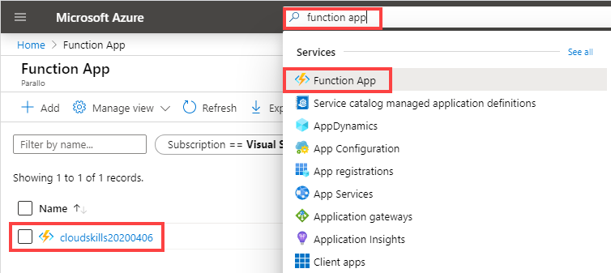

With the function app opened, click on **Platform features** and then click on **identity**.

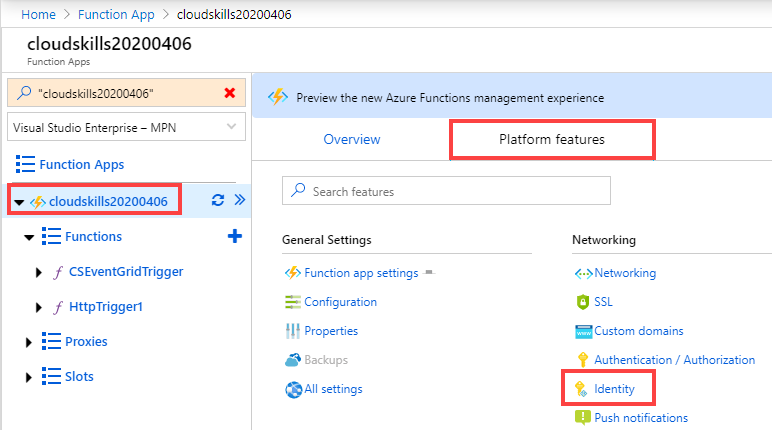

In this post you will configure a system assigned managed identity. Toggle the status to **On** and click **Save**. You'll be asked if you want to enable the managed identity, click **yes** to that as well. Note that the managed identity being registered will be named the same as your function app.

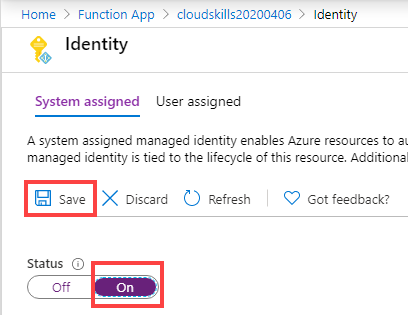

After a few moments the Object ID for the managed identity will be shown on this page. Copy that to the clipboard as you will use it to assign a role to the managed identity using PowerShell.

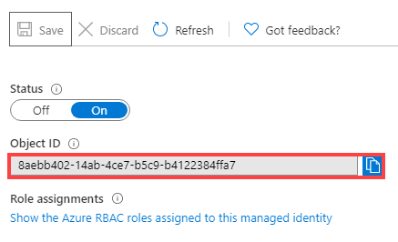

You now need to assign a role for the newly created managed identity. In this example the managed identity is being assigned the contributor role on the subscription. You may want to scope this further depending on your requirements, such as targetting a resource group rather than an entire subscription. To find your subscription ID, use `Get-AzSubscription`. Open up [Cloud Shell](https://shell.azure.com/) and run the following command:

```powershell
New-AzRoleAssignment -ObjectId 8aebb402-14ab-4ce7-b5c9-b4122384ffa7 -RoleDefinitionName Contributor -Scope /subscriptions/b0d214f3-4b5b-45f6-a841-db43c23acbba/
```

In this step you configured the function app to use the managed identity and created a new role assignment in Azure to provide the managed identity with access to resources. You now can objects in Azure from within your functions.

## Step 2 — Creating a Cost Center Function

In an earlier blog post in this series you created an event grid function, which was triggered following a particular event, processed some data then wrote the processed data out to a table in Azure Storage.

In this step you will create another event grid function, but instead of writing out to another application or service, the function will leverage the newly assigned role from the previous step to modify an Azure resource directly. The function will look for when a new resource group is created, and based on the value of a tag named `Env`, will then add another tag to the resource group named `CostCenter` with an appropriate value, either `0001` if the Env tag is Development, or `0002` if the Env tag is Production.

This paragraph is going to be high-level steps as you went through this in the previous post in this series. If you haven't read that post, please refer to it for the detailed walk-through steps. In the Azure Portal, open your function app and create a new function based on an Azure Event Grid Trigger. Add an event grid subscription with the following settings:

- **Topic Types**: Azure Subscriptions
- **Filter to Event Types**: Resource Write Success

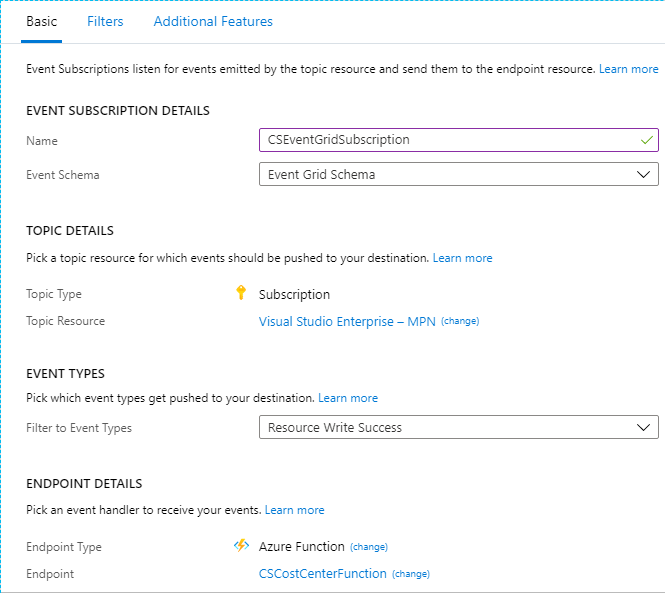

Next, after your event grid subscription is created, you will be back in the editor looking at the run.ps1 file. Copy the PowerShell function below and click **Save**.

```powershell
param($eventGridEvent, $TriggerMetadata)

$costCenterDevelopment = "0001"
$costCenterProduction = "0002"

$eventSubject = $eventGridEvent['subject']

if ($eventSubject.contains('resourcegroups')) {
  $rg = Get-AzResourceGroup -Id $eventSubject -ErrorAction SilentlyContinue

  if($rg -and $rg.Tags['Env']){
    switch($rg.Tags['Env']){
      "Development" {
        $rg.Tags.Add('CostCenter', $costCenterDevelopment)
        Set-AzResourceGroup -Name $rg.ResourceGroupName -Tag $rg.Tags
      }
      "Production" {
        $rg.Tags.Add('CostCenter', $costCenterProduction)
        Set-AzResourceGroup -Name $rg.ResourceGroupName -Tag $rg.Tags
      }
    }
  }
}
```

Notice in this code the PowerShell Az cmdlets are being leveraged to Get and Set Resource Groups. By default, when a PowerShell function is created, behind the scenes there are some extra files. You will explore those further in a later blog in this series, but one of those files is `requirements.psd1`, which contains the following code:

```powershell
# This file enables modules to be automatically managed by the Functions service.
# See https://aka.ms/functionsmanageddependency for additional information.
#
@{
    'Az' = '3.*'
}
```

What this means is that the Az PowerShell modules are loaded with the function and are available for use.

Finally, go ahead and create a test empty resource group so the new function is triggered. Make sure during creation you assign a tag with a Name of `Env` and the value is either `Development` or `Production`. You can use the PowerShell example below to create a resource group.

```powershell
New-AzResourceGroup -Name costcenter-rg01 -Location 'West US' -Tag @{Env="Development"}
```

After a few moments, if you watch the log stream you will notice the function is triggered. If you check the tags on your resource group, you now will have an additional tag with a name of `CostCenter`.

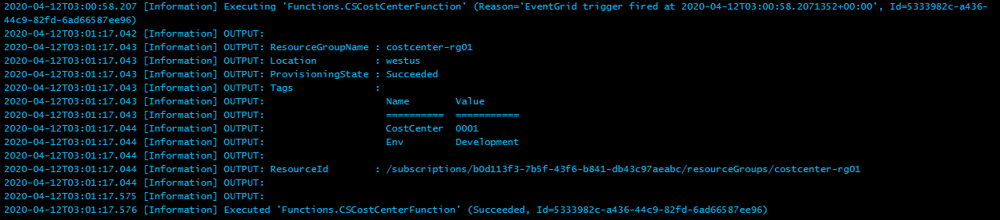

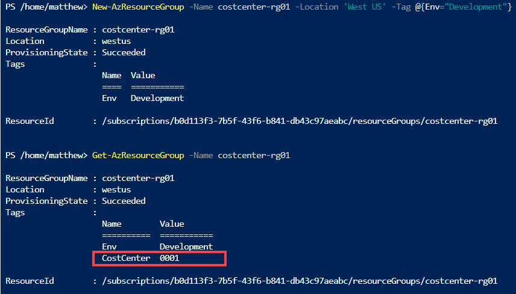

This capability provides you with effectively an unlimited range of options on configuring role-based access control to your Azure resources to then manage and maintain them using Azure Functions. In the last section of this post, you will learn how to access secrets stored in Azure Key Vault such as password and API keys securely from your function.

## Step 3 — Accessing Secrets from Azure Key Vault

Occasionally you will want your function to connect to an endpoint that it is not authorized to by default. This could be an Azure resource, such as the guest operating system of a virtual machine, or it could be an external service such as an alerting system. Hopefully it goes without saying, but just in case, it is not a good idea to save these secrets in the `run.ps1` file in clear text. Historically, the method was to create a new "application setting" within the function app which has a name and a value. The application settings can be called from the PowerShell function by using an environment variable such as `$env:AppSettingName`. Application settings are encrypted at rest and are transmitted over an encrypted channel, but they can still be exposed in plain text and there are no advanced secrets management capabilities such as versioning or auditing.

In late 2018 Microsoft announced support for accessing Azure Key Vault secrets from a function app. The good news (for backward compatibility) is that it still uses the function application setting, instead of putting the secret itself in the value, you enter a reference to the Azure Key Vault secret. In this step you will add an application setting and store the value directly in the application setting. Next, you will create a new Azure Key Vault, provide the managed identity we created in Step 2 access to the Key Vault, create a new secret within the Key Vault and finally, update the value of the application setting to reference the Key Vault Secret instead of storing the value directly.

First, select your function app in the Azure Portal, click on **Platform features** and then click on **Configuration**.

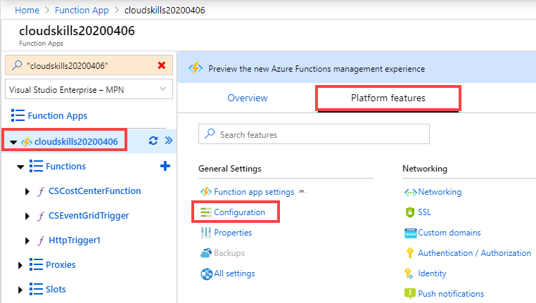

Click **New Application Setting**, for the Name enter `AlertSystemAPI` and for the value enter `KeUkcwjdBIrmgEzvKOlRuNKowAfg` and then click **ok**. This isn't a real key for anything, it is simply an example.

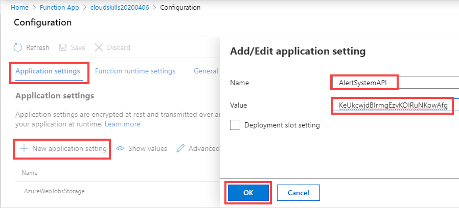

On the configuration screen, click on **save** and click **continue**. At this point in time, you would be able to reference the value of this new application setting by using `$Env:AlertSystemAPI` in your PowerShell code inside of `run.ps1`.

Next, you will create an Azure Key Vault. The examples below are done in PowerShell to make it easier than navigating through the portal with screenshots. You might try it as well using PowerShell from the Cloud Shell, or https://shell.azure.com.

```powershell
New-AzKeyVault -Name CSFunctionVault -ResourceGroupName functiondemo -location "Australia East"
```

Followed by providing the managed identity of the function app (the ObjectID being used below is the same one we used in step 1) access to get secrets from the new vault, as well as providing your account access to get and set secrets. Just make sure to update the value of `-UserPrincipalName` in the text below:

```powershell
Set-AzKeyVaultAccessPolicy -VaultName CSFunctionVault -ObjectId 4f14fcc6-b345-4f8c-9589-5d21edd0772c -PermissionsToSecrets get -PassThru

Set-AzKeyVaultAccessPolicy -VaultName CSFunctionVault -UserPrincipalName your.name@domain.com -PermissionsToSecrets set,get -PassThru
```

Finally, you will create a new secret in the vault with a name of `AlertSystemAPI` and a value of `KeUkcwjdBIrmgEzvKOlRuNKowAfg`:

```powershell
$secret = ConvertTo-SecureString -String 'KeUkcwjdBIrmgEzvKOlRuNKowAfg' -AsPlainText -Force

Set-AzKeyVaultSecret -VaultName CSFunctionVault -Name AlertSystemAPI -SecretValue $secret
```

In the output of the last command, you will see an ID for the secret that has been created. Copy this ID to your clipboard, you will need it in a moment.

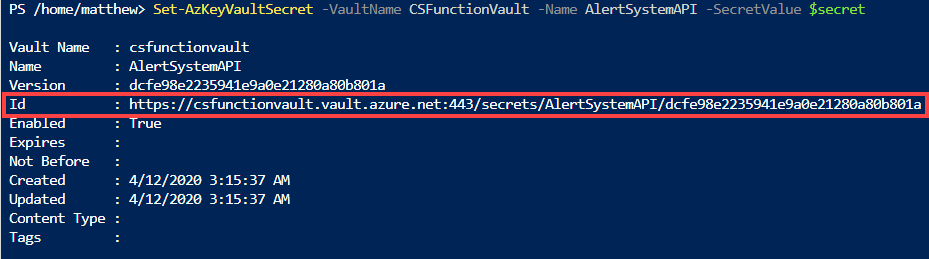

Lastly, you will now update the value of the application setting in the function app to reference the secret you just created. In the Azure Portal, navigate back to your function app, click on Platform features and Configuration. Click on the Edit button for the entry named `AlertSystemAPI` and replace the value with the following, making sure to replace \<SecretID> with the ID that you copied in the last step:

`@Microsoft.KeyVault(SecretUri=<SecretID>)`

For example:

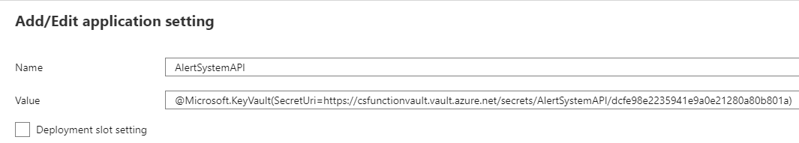

You still reference this value by using `$Env:AlertSystemAPI` in your PowerShell code inside of `run.ps1`, but now instead of the value being stored in the function app, it is stored in a central Key Vault providing the standard and regulations of secrets management.

## Conclusion

In this article you configured a managed identity on a function app and configured an Azure role assignment to a subscription for the managed identity. This provides the ability for functions within the function app to manage Azure Resource that is has delegated access to. Next, you deployed another event grid function and used logic within the PowerShell function to put a cost center tag on a new resource group, dependant on which environment tag value was assigned to the resource group during deployment.

Finally you reviewed the application settings within a function app to understand how environmental values are stored and called. Though these are encrypted at rest and in flight, they lack some core secrets management capabilities, so you enhanced this functionality by creating an Azure Key Vault Secret in a new Key Vault and referenced the secret from the function app application settings.

Next up in this series you will look at developing and running functions locally in Visual Studio Code, followed by deploying the function to Azure directly from Visual Studio Code.