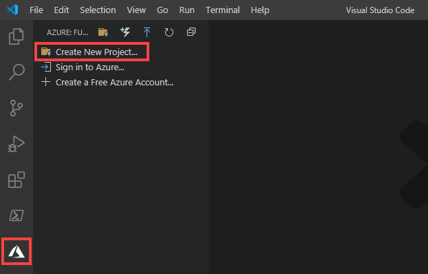
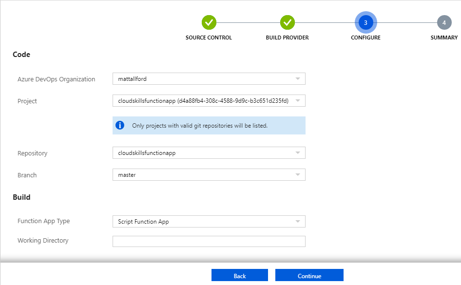

# Azure Functions: Developing and Deploying from Visual Studio Code and CI/CD with DevOps

### Introduction

Throughout this blog series on Azure Functions, you've performed all tasks with functions in the Azure Portal. This is OK for small functions or demos, but in production you will find benefit in developing functions in an integrated development environment (IDE) such as Microsoft Visual Studio Code. Not only will you have the benefit that an IDE brings when writing code, but you will also be able to run functions locally on your machine for test and debugging purposes before they are deployed to Azure.

In this guide, you will configure your machine to enable you to create, develop, debug and deploy Azure function apps and functions directly from your machine without touching Azure Portal once. You will add a third party PowerShell Module from the PowerShell gallery as a requirement of the function app and observe this being loaded when the function is triggered.

When you're finished, you'll be able to create, configure and test Azure functions locally on your machine and then deploy them into an Azure function app using multiple methods. You'll also have a fundamental understanding of some of the other files that encompass a function app that you have not been exposed to in this blog series to date.

## Prerequisites

Before you begin this guide you'll need the following:

- (optional) Familiarity with PowerShell would be beneficial.
- An [Azure Subscription](https://azure.microsoft.com/en-us/), you can create a free account if you don't have an existing subscription.
- An [Azure DevOps Organisation](http://dev.azure.com/), which is free for the first five users.
- A local installation of [Git](https://git-scm.com/). Follow the [install guide](https://git-scm.com/book/en/v2/Getting-Started-Installing-Git) for your operating system.
- PowerShell Core 6.2 or higher. This demo uses [7.0.0](https://github.com/PowerShell/PowerShell/releases/tag/v7.0.0).
- [Visual Studio Code](https://go.microsoft.com/fwlink/?linkid=2016593)
    - Following the installation of Visual Studio Code, open the application and click on extensions. Search for and install `PowerShell` and `Azure functions`.
- [Node.JS](https://docs.npmjs.com/getting-started/installing-node#osx-or-windows) version manager to then install the [Azure Functions Core tools](https://docs.microsoft.com/en-us/azure/azure-functions/functions-run-local?tabs=windows%2Ccsharp%2Cbash):
    - If on windows, browse to the Node.JS link above and scroll down to **Windows Node version managers** and click on either of the options. We will use `nodist`.
    - You are taken to a github page. Scroll down to the Readme file and there is a link to the releases page. Click on this and then download and install the latest release.
    - After the latest release is installed, open an administrative command prompt and run `npm install -g azure-functions-core-tools@3`
- [.NET Core 2.1](https://aka.ms/dotnet-core-applaunch?framework=Microsoft.NETCore.App&framework_version=2.1.0&arch=x64&rid=win10-x64). Though there is .NET core 3.x, at the time of writing this blog, the PowerShell worker in Azure function Core Tools is still [relying on the .NET 2.1 framework](https://github.com/Azure/azure-functions-host/issues/5669). As soon as this is updated by Microsoft, you will be able to use .NET Core 3.x.


## Step 1 — Creating a Function Locally

In this step you will go through the process of creating an Azure function locally on your machine using the tools that were installed in the prerequisites section. You will also see some additional files within a function app that, to date in this blog series, you have not yet seen.

Firstly, create a folder on the file system that will become your project folder. This example will use the path `C:\CSFunctionApp`:

```command
mkdir C:\CSFunctionApp
```

Launch Visual Studio Code and click on the Azure Functions icon on the left-hand side. Click on **Create New Project...** and then browse to the folder you created above.



The "Create new project" wizard will open at the top of Visual Studio Code, guiding you through the creation of the function app and your function. In this guide the following settings were chosen:

- **Language**: PowerShell
- **Template**: HTTP trigger
- **Function Name**: CSTriggerFunc
- **Authorization Level**: Anonymous
- **Open your project**: Open in current window

A new function app is created in your project folder along with a new function.


Let's break down the structure and some of these files.

You can think of your project folder, `CSFunctionApp` in this example, as the function app itself.

- **.vscode** folder: This is specific to Visual Studio Code and contains configuration information that Visual Studio Code uses when loading and editing the project
- **host.json**: This is a metadata file that contains global configuration optics that affect all functions within this function app.
- **.funcignore**: This contains files that will be ignored in a deployment of this app from the local environment to Azure
- **.gitignore**: A standard file used in git repositories to list files that will not be included in git actions
- **local.settings.json**: This stores app settings, connection strings and settings used by the local development tools. These settings are only used when you are running the functions locally. You will notice this file is listed in the .funcignore file
- **profile.ps1**: This is effectively a PowerShell profile that executes when the function app starts, which is either when the function app is first deployed or after being idle.
- **proxies.json**: The Azure functions proxies is a toolkit that allows you to modify the requests and responses of your APIs. You can expose multiple function apps built as a microservice architecture in a single unified endpoint.
- **requirements.psd1**: This is a PowerShell Manifest file, and in the context of Azure Functions, this is where you can list any dependencies for your function. By default, dependencies are enabled and the `Az` module is listed. This is why by default, you can leverage Az PowerShell cmdlets within a function. Later in this blog you will add another module from the PowerShell Gallery as a dependency and then see those cmdlets are available inside the function.

Within the function app as you learned in previous posts, you can have multiple functions. Each function has a folder with its code file (`run.ps1`) and binding configuration file (`function.json`). These are the same files you have seen in the Azure Portal in previous posts in this series. The name of the directory is the name of your function and you can see in this example the directory is named `CSTriggerFunc`. If you were to create another function in this project, a new folder would be created with the same name as the function, with its own `run.ps1` and `function.json` files. All functions share the function app configurations outlined in the bullet points above.

You've successfully created a local function app and a HTTP based function and observed the files that are created in the local project. In the next step you will run and test the function locally on your machine.

## Step 2 — Running the Function Locally

Having the ability to run functions locally before deployment to Azure allows you to ensure the functions are behaving as expected and means you can quickly test and view the function logs.

First, in Visual Studio Code click on `run.ps1` inside of your function folder if it is not already open. Click on Run > Start Debugging, or press F5, to launch the function locally. You may be prompted to allow the executable through the Windows Firewall. In the terminal at the bottom you will see the function worker runtime launch which will result in providing you with a local endpoint for your function:


Sometimes I have noticed that the debugger pauses on some of the modules during loading. Keep an eye on the debug control panel in the middle at the top of VS Code and if required, click on the play (triangle) button to keep running. Remember that on first run the function will load dependencies, which means it will go and download all of the `Az` modules from the Powershell Gallery, so it could take a minute or two for it to be ready on your machine.

Finally, leave the function running in the VS Code terminal and open another separate PowerShell window to trigger the function. Inside of PowerShell, run the following to trigger your function, making sure to change the port if required (refer to the URI provided to you in the VS Code terminal) and the name of the function:

```powershell
Invoke-RestMethod -Method get -Uri http://localhost:7071/api/CSTriggerFunc?name=Matt
```


In the Visual Studio Code terminal you will see some logs similar to what we see in the Log Streaming window in the Azure Portal. This is also where you can observe any `Write-Output` lines from the `run.ps1` code.

Now that you've developed and tested your function locally, it is time to get it deployed to Azure and test the function in Azure post-deployment. Leave the PowerShell console where you ran `Invoke-RestMethod` from open as you will use that again in a moment, click back into Visual Studio Code and click **run** > **stop debugging**.

## Step 3 — Deploying to Azure from Visual Studio Code

Visual Studio Code has an option to deploy directly from your local environment into Azure. It is reasonably flexible, you can create a new function app during deployment or deploy to an existing function app.

In this step you will deploy the local function app (and therefore all included functions) from your machine to a new function app in Azure, all from Visual Studio Code. You will then connect to the log-stream output from VS Code and test the function is working as expected.

Firstly in VS Code, click on the Azure Functions icon on the left-hand side and click the icon to **Deploy to Function App**. A new wizard will start at the top of VS Code asking you to Sign In to Azure (if you weren't already signed in). Click **Sign in to Azure**


A web page will open asking for your credentials to log in to Azure. When prompted you can close this and return to VS Code where, in the wizard, you will be asked to select a subscription to deploy to. In this guide you will create a new function app to deploy to, so click on **Create new Function App in Azure** (you can use the advanced option if you want to choose things like resource groups, storage accounts, etc, else these will be deployed for you). Provide a unique name for the function app, this guide is using `cloudskillsfunctionapp` and press enter. A new resource group and storage account will be created for you behind the scenes. Finally, select a region for your resources. If you monitor the progress in the bottom right of VS Code, you will see a new Resource Group, Storage Account and Function App be deployed. Your local function app will then be deployed directly into Azure, all in one process.

Still in the Azure Functions extension in VS Code, when you expand your subscription you will see the new function app. Expand the function app and expand functions, you will see the function we tested locally is now deployed to Azure. Right-click on the function and click **Copy Function Url**. Right-click on the function again and click **Start Streaming Logs**. 


In the terminal in VS Code, a connection to the log stream in Azure for this function will be started. Click back on the separate PowerShell console from the previous step, or open a new one if you closed it, and run `Invoke-restmethod` again to trigger the function within Azure. For the Uri, you can click paste to paste the URL we copied a moment ago. Don't forget to append the name query:

```powershell
Invoke-RestMethod -Method get -Uri https://cloudskillsfunctionapp.azurewebsites.net/api/CSTriggerFunc?name=Matt
```


You will see familiar messages in the log stream in VS code, showing the function has been called, dependencies are being downloaded and finally the function has executed:


## Step 4 — Adding a PowerShell Module from PS Gallery

There will be times where you want to leverage custom modules within your function code. With PowerShell, the easy way to achieve this is to download the PowerShell module from the PowerShell Gallery. Doing this in a PowerShell function is quite straight forward, but you do want to ensure you don't bloat out your functions. In general, make your functions as stripped down as possible and only load what is required to execute the function.

First in VS Code click on the explorer icon to bring up the folder and file structure. Click on `requirements.psd1`, add the following to line 6 and save the file:

```
'PSSlack' = '1.*'
```


Next, click on `run.ps1` and insert the following on line 8 and save the file:

```powershell
get-command -Module PSSlack | out-string | write-output
```


Click on the Azure Functions extension in VS Code and click on **Deploy to Function App**. Select the subscription and this time instead of creating a new function app, select the function app you created in the last step. You will be prompted to confirm this deployment will overwrite any previous deployments. Click on Deploy.


The updated function app will be deployed to Azure. Still in the Azure Functions extension, expand your subscription > function app > function, right-click on the function and click Start Streaming Logs.

Finally, click back on the separate PowerShell console from the previous step, or open a new one if you closed it, and run `Invoke-RestMethod` again to trigger the function within Azure.

```powershell
Invoke-RestMethod -Method get -Uri https://cloudskillsfunctionapp.azurewebsites.net/api/CSTriggerFunc?name=Matt
```

It will take a minute or two, then in the Log Stream output, you will see an output of the command `get-command -Module PSSlack`, showing that the module had been installed as per the `requirements.psd1` modification. If you needed to, you can now leverage cmdlets from this PowerShell module in your function code.


If you open the function app in the Azure Portal, you will see that the functions are in Read-Only mode and you will be unable to make any changes from the portal. This is due to the function app being deployed from a package file from VS Code and you wouldn't want any changes to be made in the Azure Portal that your local copy wasn't aware of.


The final step in this series is a big one but an exciting one, taking you through the process of setting up continuous integration and continuous deployment for Function Apps via a git repository in Azure DevOps.

## Step 5 — Continuous Integration and Continuous Deployment

First, browse to dev.azure.com and log in to your Azure DevOps Organisation. Click **+ New Project** to create a new project. Ours is called `cloudskillsfunctionapp`. Leave the repo as private and click **Create**.


Click on Repos and copy the text in the **Push an existing repository from command line**, you will use that in a moment.


Next, you will initialize a git repo in the folder containing the local function app you've been working with in this post. Open a command or PowerShell prompt and navigate to the root folder for where your function app is located, which for us is `C:\CSFunctionApp`.

If this is the first time you've installed git on your machine, you will need to set some git configurations for your name and email address:

```
git config --global user.email "you@example.com"
git config --global user.name "Your Name"
```

Run git commands to initialize a local repository, add the repo from your new Azure DevOps project as a remote and then push the repo from local to remote. The last two commands below were copied from the Azure DevOps portal in the previous step.

```
git init
git add .
git commit -m "Initial Commit"
git remote add origin https://mattallford@dev.azure.com/mattallford/cloudskillsfunctionapp/_git/cloudskillsfunctionapp
git push -u origin --all
```

When doing the `git push` you will be asked to authenticate. A window will open asking you to sign in to Azure DevOps. Behind the scenes this will go and create a Personal Access Token git will use to authenticate to the Azure DevOps repo.

You can refresh the page open in your Azure DevOps repo and you will see the function app code now located in the repository.


The next step is to create a new function app in Azure based on PowerShell and connect it to the Azure DevOps repository. Log in to the [Azure Portal](https://portal.azure.com) and create a new function app. This has been covered several times in this blog series before, so we won't go over it again here. We will name our function app `cloudskillsfunctiongit`.

When the function app is created, open it in the Azure Portal, click on **Platform features** and click **Container Settings** under Code Deployment.


Select the option to configure integration with an Azure Repo and click continue.


Select the option to use Azure Pipelines and click continue.


Use the drop-down menus to select the Azure DevOps organization, project, repository and branch that you just created for this purpose. The Build section can be left as default.



Review the configuration and click Finish to start the build and release process. Behind the scenes this will go and configure a build and release pipeline inside of the Azure DevOps project and perform an initial build and release, taking the code you pushed to the repo and deploying the function app. You can see the integration with Azure DevOps directly from the function app in the Azure Portal, including visibility into deployments with links directly to the build and release items in the Azure DevOps portal.


You can now manage and maintain the source code for your functions in git to realize source control benefits and experience the full power of continuous integration and continuous development. When new commits are pushed to the master branch of the Azure DevOps repository, DevOps will trigger a build and release and update the function app without you needing to do anything.

## Conclusion

In this article you used Visual Studio Code and the Azure Functions Core Tools to create an Azure function locally on your machine and reviewed the file and folder structure of a PowerShell function app. You ran the function right from VS Code and used PowerShell's `Invoke-RestMethod` to trigger and test the function.

Next you used VS Code's Azure functions extention to deploy the function from the local development environment directly in to Azure, creating a new function app in the process. You then added a PowerShell module from the PowerShell Gallery as a requirement to the function app and redeployed the function app, afterward triggering the function and reviewing the PowerShell module get loaded.

Finally, you brought everything together and placed the function app code in a git repository. You then pushed the git repository to an Azure DevOps repository and created a final new function app that was configured to integrate directly with the Azure DevOps Repo. Lastly, you configured a CI/CD process and observed the function get deployed automatically from the DevOps git repo in to the Azure Function app.